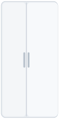

# HA Fridge Card

Custom [Home Assistant](https://www.home-assistant.io/) Lovelace card for displaying fridge and freezer temperatures with multiple fridge layout options.

> **Fork** of [chiconws/ha-fridge-card](https://github.com/chiconws/ha-fridge-card) with a new **Side by Side** layout.

## Layouts

| Layout | Preview | Description |
|---|---|---|
| `default` |  | Freezer on top, fridge on bottom |
| `inverted` |  | Fridge on top, freezer on bottom |
| `dual_door` |  | Two vertical doors: freezer 40% (left) / fridge 60% (right) |
| `french_door` |  | French door (two doors on top + drawer on bottom) |
| `freezer` |  | Freezer only |

## Installation

### HACS (recommended)

1. Open HACS in Home Assistant
2. Go to **Frontend** → **+ Explore & Download Repositories**
3. Click **⋮** (top right) → **Custom repositories**
4. Add: `https://github.com/fernandodimas/ha-fridge-card` — Category: **Dashboard**
5. Click **Download**
6. Restart Home Assistant

### Manual

1. Download `dist/ha-fridge-card.js` from the [latest release](https://github.com/fernandodimas/ha-fridge-card/releases)
2. Copy it to your `config/www/` folder
3. Add the resource in **Settings → Dashboards → Resources**:
   - URL: `/local/ha-fridge-card.js`
   - Resource type: **JavaScript Module**

## Usage

```yaml
type: custom:ha-fridge-card
title: "Geladeira"
layout: dual_door
freezer_entity: sensor.freezer_temperature
fridge_entity: sensor.fridge_temperature
freezer_label: "Congelador"
fridge_label: "Geladeira"
card_width: 230
card_height: 387
```

## Options

| Option | Required | Default | Description |
|---|---|---|---|
| `type` | Yes | — | `custom:ha-fridge-card` |
| `title` | No | `Fridge` | Card title |
| `layout` | No | `default` | `default`, `inverted`, `dual_door`, `french_door`, `freezer` |
| `freezer_entity` | No* | — | Entity ID for the freezer temperature sensor |
| `fridge_entity` | No* | — | Entity ID for the fridge temperature sensor |
| `freezer_label` | No | `Freezer` | Custom label for the freezer section |
| `fridge_label` | No | `Fridge` | Custom label for the fridge section |
| `card_width` | No | `230` | Card width in px (100–400) |
| `card_height` | No | `387` | Card height in px (200–600) |

\* At least one entity is required.

## License

MIT
